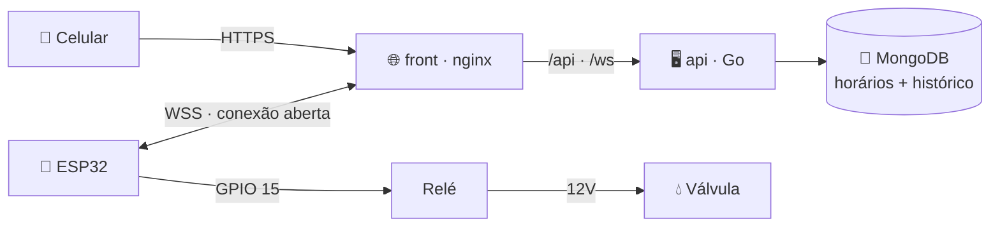

# 🪴 Sistema de Irrigação

Irrigação automática por ESP32: rega nos horários programados e também na mão,
pelo celular, de qualquer lugar do Brasil.

```
[ água ] → [ válvula 12V ] → [ cano PVC deitado ] → [ micro-mangueiras ] → 🪴🪴🪴
                  ↑
             [ relé ] ← [ ESP32 ] ←→ 📶 internet ←→ [ API + site ] ←→ 📱
```

---

## Como funciona

O ESP32 fica numa casa, o servidor em outra. Os dois se encontram num endereço
na internet — e é o ESP32 que **abre** a conexão, então não precisa mexer em
roteador nenhum.



O celular fala com a API; a API **empurra** o comando pelo WebSocket que o ESP32
mantém aberto. A conexão viva é a própria detecção de "aparelho online" — o site
avisa em vermelho quando o ESP32 está fora do ar, pra ninguém achar que tem água
correndo quando não tem.

**Não tem login.** Quem abre o endereço, controla. Foi escolha consciente: o
usuário é um senhor de 67 anos e senha seria barreira. O pior caso de alguém
descobrir o endereço é molhar o jardim.

---

## Repositório

| Pasta | O que é | Imagem no Docker Hub |
|---|---|---|
| [`api/`](api/) | API em Go + agendador → [SPEC.md](api/SPEC.md) | `icarocedraz/sistema-de-irrigacao:api-*` |
| [`web/`](web/) | Site em HTML puro + nginx | `icarocedraz/sistema-de-irrigacao:front-*` |
| [`deploy/`](deploy/) | **O único que vai pro servidor** | — |
| [`firmware/`](firmware/irrigacao/irrigacao.ino) | Sketch do ESP32 | — |

### Rodar na sua máquina

```bash
cp .env.example .env
sed -i '' "s|^DEVICE_TOKEN=.*|DEVICE_TOKEN=$(openssl rand -hex 32)|" .env
make up
```

Abre em `http://localhost:8080`.

---

## Deploy

### 1. Publicar as imagens (no Mac)

```bash
docker login
make publicar TAG=v1
```

Que é o mesmo que:

```bash
docker buildx build --platform linux/amd64 \
  -t icarocedraz/sistema-de-irrigacao:api-v1 \
  -t icarocedraz/sistema-de-irrigacao:api-latest --push ./api

docker buildx build --platform linux/amd64 \
  -t icarocedraz/sistema-de-irrigacao:front-v1 \
  -t icarocedraz/sistema-de-irrigacao:front-latest --push ./web
```

O `--platform linux/amd64` é obrigatório: o servidor é x86 e o Mac é ARM.
Sem ele a imagem sobe, o `pull` funciona, e o container morre com
`exec format error`.

### 2. No servidor: dois arquivos, nada mais

Antes, um teste de 1 segundo — o MongoDB 5+ exige a instrução AVX do
processador, e placas H510 às vezes vêm com Pentium/Celeron que não têm:

```bash
grep -o -m1 avx /proc/cpuinfo    # tem que imprimir "avx"
```

Se não imprimir nada, o `mongo:8` morre com `Illegal instruction`.

```bash
mkdir -p ~/Documentos/irrigacao && cd ~/Documentos/irrigacao
nano docker-compose.yml   # cole o conteúdo de deploy/docker-compose.yml
nano .env                 # DEVICE_TOKEN=<o mesmo do firmware>
docker compose up -d
```

### 3. Expor

```bash
cd ~/Documentos && ./expor.sh --sub irrigacao --porta 10006
```

### 4. Conferir

`https://irrigacao.cedraz.dev` tem que abrir mostrando **"O aparelho está
desligado ou sem internet"** — certo, porque o ESP32 ainda não foi gravado.

### Atualizar depois

```bash
make publicar TAG=v2                                  # no Mac
```

```bash
docker compose pull                                   # no servidor
docker compose up -d --force-recreate api front
```

O `--force-recreate` é necessário: versões antigas do Docker Compose baixam a
imagem nova mas não percebem que ela mudou, e deixam o container velho rodando.
Sinal de que isso aconteceu: no `docker ps`, a coluna IMAGE mostra um ID
(`075815ec5194`) em vez de `icarocedraz/sistema-de-irrigacao:...`.

---

## Hardware

### Caminho da água
mangueira → adaptador de caixa d'água 20mm×1/2" → cano PVC 20mm → joelho 90° →
luva soldável×rosca → **válvula solenoide 12V** (seta no sentido do fluxo) →
luva soldável×rosca → cano PVC deitado ao longo dos vasos (ponta com tampão) →
espigões → micro-mangueiras 4/7mm → gotejadores ajustáveis.

Cola de PVC nas juntas lisas, veda-rosca nas roscadas. A dose de cada vaso é
feita no gotejador, não na eletrônica — **uma válvula só** controla tudo.

### Ligações

| Relé | ESP32 |
|---|---|
| VCC | `3V3` |
| GND | `GND` |
| IN | `GPIO 15` |

| De | Para |
|---|---|
| Fonte 12V (+) | `COM` |
| `NO` | pino 1 da válvula |
| Fonte 12V (−) | pino 2 da válvula (direto, não passa pelo relé) |

A válvula não tem polaridade. Display ST7789 240×240 em `DC=2`, `RST=4`.

**Diodo 1N4007 em paralelo com a válvula** — listra (cátodo) no fio que vem do
`NO`, lado sem listra no fio preto. A bobina solta um pico de tensão toda vez
que o relé desliga: sem o diodo, esse pico queima os contatos do relé aos
poucos e embaralha a tela (pixels coloridos). Invertido, o diodo vira curto
quando o relé liga — confira com a fonte fora da tomada.

### Aprendido na marra

- **O relé aciona em nível BAIXO.** `digitalWrite(LOW)` abre. Pra fechar, o pino
  volta pra `INPUT` (flutuando) em vez de ir pra `HIGH` — é assim que esta placa
  funciona de verdade, e evita acionar o relé durante o boot.
- **GPIO 23 não serve**: é o MOSI do SPI, fica preso em HIGH.
- **Módulo relé, não relé "pelado"**: o módulo tem o transistor que amplifica o
  sinal fraco do ESP32.
- **Altura importa**: reservatório baixo dá vazão fraca. Fonte, sentido do fluxo
  e fiação já foram descartados como causa.
- **Furo de respiro** no topo do reservatório, senão trava por vácuo.

### 🔌 O interruptor da caixa

Continua ligado no **GPIO 13**, mas **o firmware não lê mais esse pino**. Mexer
nele não faz nada.

Ele foi desligado porque brigava com o comando do celular e derrubava a placa:
cada acionamento redesenhava a tela inteira dentro do callback do WebSocket
(~100ms de SPI travando o laço), e o repique do contato disparava isso várias
vezes seguidas até o watchdog reiniciar o ESP32.

### ⚠️ Segurança

- **Nunca** mexer nos fios com a fonte na tomada.
- "Choquinho" em 12V DC **não é normal** — fonte com isolamento ruim, troque.
- **A válvula fecha sozinha em quatro camadas independentes**: o firmware fecha
  se a conexão cair; o firmware tem teto de 30 min; a API manda fechar quando o
  prazo acaba; e a API fecha antes de encerrar. Válvula aberta sem ninguém pra
  fechar é alagamento.
- No boot e em qualquer reset, o pino fica em `INPUT` — válvula fechada.

---

## Status

- [x] Relé acionando pelo ESP32
- [x] API em Go + MongoDB, com agendamento por dia da semana
- [x] Site em HTML puro, servido por nginx
- [x] Imagens `api` e `front` + compose do servidor
- [x] Firmware conectando na API por WebSocket, sem o interruptor
- [ ] Publicar a API no servidor caseiro com domínio e HTTPS
- [ ] Gravar o firmware com o `DEVICE_TOKEN` e o endereço reais
- [ ] Testar com água de verdade
- [ ] Montagem física: colagens, furos no cano, fixação do reservatório
